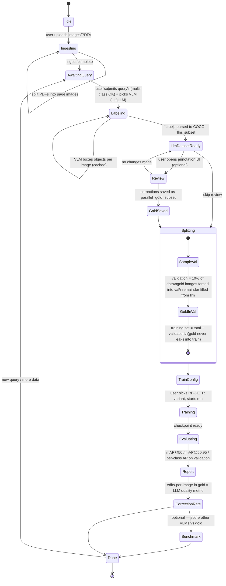

# State diagram

```mermaid
stateDiagram-v2
    [*] --> Idle

    Idle --> Ingesting: user uploads images/PDFs
    Ingesting --> Ingesting: split PDFs into page images
    Ingesting --> AwaitingQuery: ingest complete

    AwaitingQuery --> Labeling: user submits query\n(multi-class OK) + picks VLM (LiteLLM)
    Labeling --> Labeling: VLM boxes objects per image (cached)
    Labeling --> LlmDatasetReady: labels parsed to COCO `llm` subset

    LlmDatasetReady --> Review: user opens annotation UI (optional)
    LlmDatasetReady --> Splitting: skip review

    Review --> GoldSaved: corrections saved as parallel `gold` subset
    Review --> LlmDatasetReady: no changes made
    GoldSaved --> Splitting

    state Splitting {
        [*] --> SampleVal
        SampleVal --> GoldInVal: validation = 10% of data\ngold images forced into val\nremainder filled from llm
        GoldInVal --> [*]: training set = total − validation\n(gold never leaks into train)
    }

    Splitting --> TrainConfig
    TrainConfig --> Training: user picks RF-DETR variant, starts run
    Training --> Evaluating: checkpoint ready
    Evaluating --> Report: mAP@50 / mAP@50:95 / per-class AP on validation
    Report --> CorrectionRate: edits-per-image in gold = LLM quality metric
    CorrectionRate --> Benchmark: optional — score other VLMs vs gold
    Benchmark --> Done
    CorrectionRate --> Done

    Done --> AwaitingQuery: new query / more data
    Done --> [*]
```
